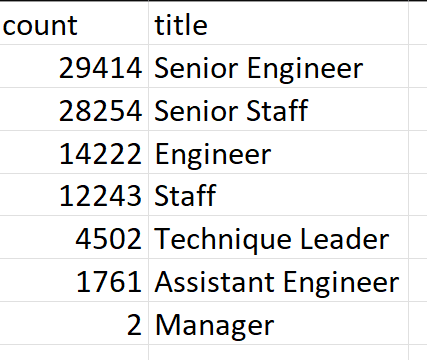
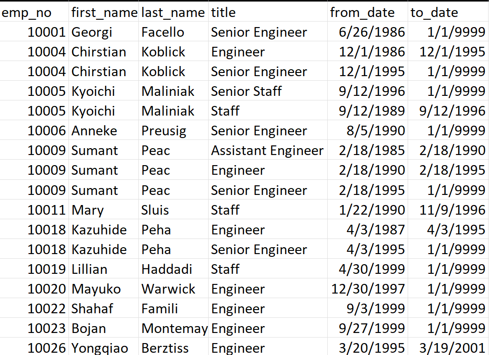
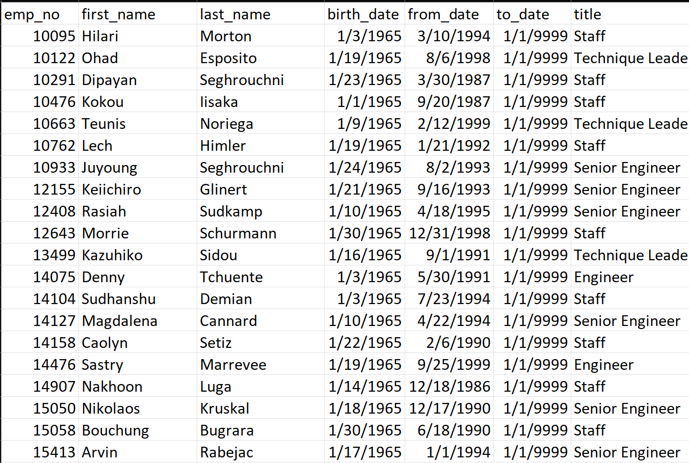

# Pewlett-Hackard-Analysis

## Project Overview
The Purpose of this analysis is to determine the number of retiring employees per title and identify employees who are eligible to participate in a mentorship program for Pewlett-Hackard Company. This report will hopefully prepare the company for the "Silver Tsunami" that will soon effect the company as many employees approach the age of retirement.

## Results

- The highest number of retiring employees fall under the titles of Senior Engineer and Senior Staff. 

- There are 29,414 opportunities for promotions to Senior Engineers available.

- The retirment_titles table shows every employee eligible for retirement and the time that the retiring employee has spent working at the company.

- The mentorship_eligibility csv shows the employees available for the mentorship program.

## Summary
There are 90,398 positions that will need to be filled for the "silver tsunami".

There are not enough quelified, retirement- ready employees to mentor the next generation since there are only 1,940 employees who are eligible to participate in a mentorship program.

